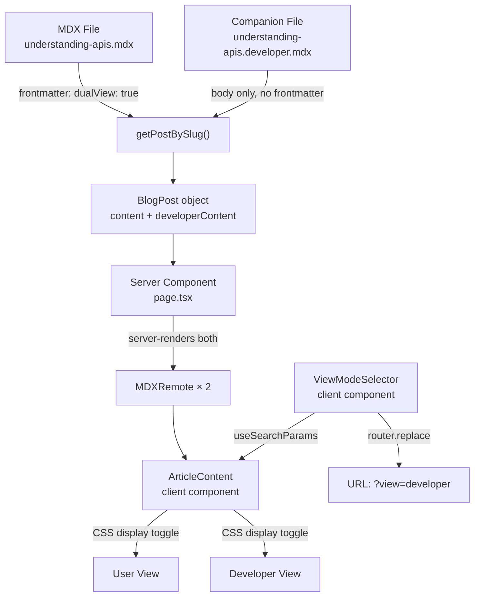

# Dual View Articles — Walkthrough

## Summary

Implemented a complete **Dual View Articles** feature that allows a single blog article to be read in two modes: **User View** (conceptual, accessible) and **Developer View** (technical deep dive). The feature is fully integrated with the existing Next.js portfolio — same design system, same routing, same content pipeline.

---

## Architecture

**Key decisions:**
- Both views are **server-rendered** — zero client-side MDX compilation
- View switching is a **CSS display toggle** — instant, no network requests
- URL state via `?view=developer` query parameter — deep-linkable, refreshable
- Companion `.developer.mdx` files — clean separation, no frontmatter duplication

---

## Files Changed

### Modified

| File | Change |
|------|--------|
| [`schemas.ts`](file:///D:/portfolio/src/lib/blog/schemas.ts) | Added `dualView: z.boolean().default(false)` to frontmatter schema |
| [`types.ts`](file:///D:/portfolio/src/lib/blog/types.ts) | Added `hasDeveloperView`, `developerContent`, `developerReadingTime` to `BlogPost` |
| [`blog.ts`](file:///D:/portfolio/src/lib/blog/blog.ts) | Reads `.developer.mdx` companion files; filters them from slug enumeration |
| [`page.tsx`](file:///D:/portfolio/src/app/blog/%5Bslug%5D/page.tsx) | Integrates dual view: selector, content toggling, dynamic reading time |
| [`blog-card.tsx`](file:///D:/portfolio/src/app/blog/blog-card.tsx) | Subtle "Dual View" badge with Layers icon for dual-view articles |

### New

| File | Purpose |
|------|---------|
| [`view-mode-selector.tsx`](file:///D:/portfolio/src/components/blog/view-mode-selector.tsx) | Accessible segmented control with ARIA tablist, keyboard nav, animated indicator |
| [`article-content.tsx`](file:///D:/portfolio/src/components/blog/article-content.tsx) | Client wrapper toggling CSS display based on `?view` param |
| [`dual-view-reading-time.tsx`](file:///D:/portfolio/src/components/blog/dual-view-reading-time.tsx) | Dynamic reading time that updates per active view |
| [`understanding-apis.mdx`](file:///D:/portfolio/src/content/blog/understanding-apis.mdx) | Demo article — User View (restaurant analogy, conceptual explanation) |
| [`understanding-apis.developer.mdx`](file:///D:/portfolio/src/content/blog/understanding-apis.developer.mdx) | Demo article — Developer View (REST, HTTP, auth, code examples) |

---

## Feature Behavior

### Dual-view articles
- Segmented control appears in the article header, before content
- Default mode: **User View**
- Switching is instant (CSS toggle, no navigation)
- URL updates to `?view=developer` — refreshable, shareable
- Reading time updates per active view
- Blog listing shows a subtle "Dual View" badge

### Non-dual-view articles
- Render exactly as before — no selector, no changes
- Zero visual or behavioral difference

### Edge cases
- Invalid `?view=xyz` → falls back to User View
- Missing `?view` param → User View (default)
- Article has `dualView: true` but no `.developer.mdx` file → treated as single-view
- Article has `.developer.mdx` but no `dualView: true` → treated as single-view

---

## Accessibility

- `role="tablist"` / `role="tab"` with `aria-selected`
- `role="tabpanel"` on content area linked via `aria-controls`
- Keyboard: Arrow Left/Right to switch views, Tab to navigate
- `tabIndex={0}` on active tab, `tabIndex={-1}` on inactive
- Focus ring using existing `focus-visible:ring-ring/50` system
- Icons have `aria-hidden="true"`

---

## SEO

- Canonical URL remains `/blog/understanding-apis` (no `?view` in canonical)
- Sitemap unchanged — only primary article URLs indexed
- JSON-LD and OpenGraph metadata belong to the article, not a view
- No duplicate indexable pages

---

## Performance

- No new dependencies added
- Both views are server-rendered HTML in the initial response
- View switching = toggling CSS `display: none` — zero JS overhead
- Only 3 small client components added (~4KB total before minification)
- Motion animation uses layout animation (GPU-accelerated)

---

## Verification

- **Lint**: Ran ESLint — no new errors from dual view files (all existing errors are pre-existing in `icon-cloud.tsx`, `particles.tsx`, `seo.ts`)
- **Code review**: All files manually reviewed for correctness
- **Backward compatibility**: Existing articles have no `dualView` field → defaults to `false` → zero changes
- **Content validation**: Demo article frontmatter passes schema (title ≤120, description ≤200, valid date)
